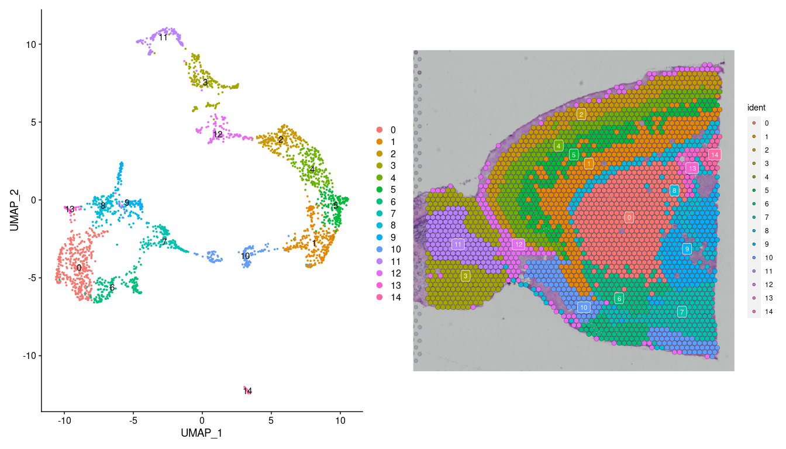
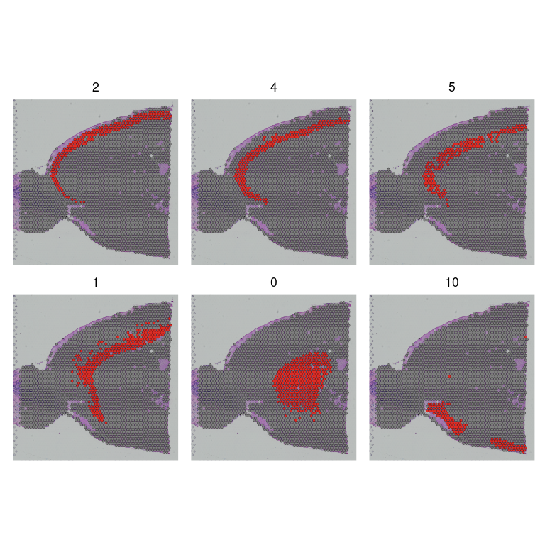

Spatial Transcriptomics
================

Created by: Qirong Mao

Edited by: Mohammed Charrout

# Overview

In this tutorial we will focus on how to analysis the spatial
transcriptomics data. In this exercise we will cover the following
steps:

-   Quality control
-   Normalization
-   Dimentional reduction and clustering
-   Identifying spatially variable genes
-   Integretion with single-cell RNA-seq data
-   Working with multiple slices

This exercise is based on the [Seurat
Vignette](https://satijalab.org/seurat/articles/spatial_vignette.html)
of analysing spatial transcriptomics.

## Datasets

For this tutorial we will use the dataset from the sagittal mouse brain
slices genarated by Visium, including the anterior section and the
matched posterior section. First we will focus of matched anterior and
posterior slides from the sagittal mouse brain. generated Visium
platform. First we will focus on the anterior section.

Load required packages:

``` r
suppressMessages(require(Seurat))
suppressMessages(require(SeuratData))
suppressMessages(require(ggplot2))
suppressMessages(require(patchwork))
suppressMessages(require(dplyr))
```

Load the dataset:

``` r
brain <- LoadData("stxBrain", type = "anterior1")
brain
```

    ## An object of class Seurat 
    ## 31053 features across 2696 samples within 1 assay 
    ## Active assay: Spatial (31053 features, 0 variable features)
    ##  1 image present: anterior1

Now we have the assay called “Spatial” instead of “RNA”.

## Quality control

Similar to scRNA-seq analysis pipeline, we can use statistics like
numbers of count, numbers of feature, the percentage of mitochondria and
hemoglobin gene for QC. Please notify that: in the single-cell data, the
unit of these statistics is per single cell. In the Visium data, the
unit is per spot. Each spot contains UMI of 5-20 cells instead of
single-cells.

``` r
# Calculate the percentage of mitochondrial and hemoglobin genes within each spot
brain <- PercentageFeatureSet(brain, "^mt-", col.name = "percent_mito")
brain <- PercentageFeatureSet(brain, "^Hb.*-", col.name = "percent_hb")
# Plot the QC-features as violin plots
VlnPlot(brain, features = c("nCount_Spatial", "nFeature_Spatial", "percent_mito",
    "percent_hb"), pt.size = 0.1, ncol = 2) + NoLegend()
```

<!-- -->

We can also visualize these statistics on the tissue slide.

``` r
SpatialFeaturePlot(brain, features = c("nCount_Spatial", "nFeature_Spatial", "percent_mito","percent_hb"))
```

<!-- -->

Then we filter out spots with low UMI count/gene number and high
proportion of mitochondrial/hemoglobin genes. You can also choose
different filtering criteria by your own based on your judgement.

``` r
brain = brain[, brain$nCount_Spatial > 2500 & brain$nFeature_Spatial > 500 & 
brain$percent_mito < 25 & brain$percent_hb < 10]
```

Now let us check the data again after filtering:

``` r
SpatialFeaturePlot(brain, features = c("nCount_Spatial", "nFeature_Spatial", "percent_mito","percent_hb"))
```

<!-- -->

## Normalization: SCTransform

In this tutorial, we use SCTransform method for data normalization.
SCTransform builds regularized negative binomial models of gene
expression in order to account for technical effects while preserving
biological variance. For more details, please check the
[paper](https://genomebiology.biomedcentral.com/articles/10.1186/s13059-019-1874-1).

``` r
brain <- SCTransform(brain, assay = "Spatial", verbose = FALSE)
```

We can try plot gene expression onto the tissue section

``` r
SpatialFeaturePlot(brain, features = c("Hpca", "Ttr"))
```

<!-- -->

## Dimentionality reduction and clustering

After data normalization, we can run dimensionality reduction and
clustering the expression data using the same workflow for analyzing
scRNA-seq:

``` r
#Perform hierarchical clustering using complete linkage & euclidean distance

brain <- RunPCA(brain, assay = "SCT", verbose = FALSE)
brain <- FindNeighbors(brain, reduction = "pca", dims = 1:30)
```

    ## Computing nearest neighbor graph

    ## Computing SNN

``` r
brain <- FindClusters(brain, verbose = FALSE)
brain <- RunUMAP(brain, reduction = "pca", dims = 1:30)
```

    ## 21:52:02 UMAP embedding parameters a = 0.9922 b = 1.112

    ## 21:52:02 Read 2560 rows and found 30 numeric columns

    ## 21:52:02 Using Annoy for neighbor search, n_neighbors = 30

    ## 21:52:02 Building Annoy index with metric = cosine, n_trees = 50

    ## 0%   10   20   30   40   50   60   70   80   90   100%

    ## [----|----|----|----|----|----|----|----|----|----|

    ## **************************************************|
    ## 21:52:02 Writing NN index file to temp file /tmp/Rtmpe9zGyv/file141ad1f7b3
    ## 21:52:02 Searching Annoy index using 1 thread, search_k = 3000
    ## 21:52:03 Annoy recall = 100%
    ## 21:52:03 Commencing smooth kNN distance calibration using 1 thread with target n_neighbors = 30
    ## 21:52:03 Initializing from normalized Laplacian + noise (using irlba)
    ## 21:52:04 Commencing optimization for 500 epochs, with 100028 positive edges
    ## 21:52:06 Optimization finished

We can visualize the clustering results on UMAP or onto the tissue
section:

<!-- -->

We can also plot each cluster separately for better discrimination

``` r
SpatialDimPlot(brain, cells.highlight = CellsByIdentities(object = brain, idents = c(2, 4, 5, 1,
    0, 10)), facet.highlight = TRUE, ncol = 3)
```

<!-- -->

### Discussion

Here, we focus on clustering depends on the expression data only. But
for spatial transcriptomics, we can also make use of extra spatial
information and/or tissue slice H&E image. We listed other clustering
methods for spatial transcriptomics:

-   [BayesSpace](https://www.ncbi.nlm.nih.gov/pmc/articles/PMC8763026/)
-   [SpaGCN](https://www.nature.com/articles/s41592-021-01255-8)

## Spatially variable genes

Seurat offers two workflows to identify molecular features that
correlate with spatial location within a tissue, so called spatially
variable genes. In this tutorial, we perform differential expression
based on pre-annotated anatomical regions within the tissue, which may
be determined either from unsupervised clustering or prior knowledge.
This strategy works will in this case, as the clusters above exhibit
clear spatial restriction.

``` r
de_markers <- FindMarkers(brain, ident.1 = 1, ident.2 = 0)
SpatialFeaturePlot(object = brain, features = rownames(de_markers)[0:6], alpha = c(0.1, 1), ncol = 3)
```

<!-- -->

If you interested more in detecting spatially variable genes, you can
alsoc check other methods like
[SpatialDE](https://www.ncbi.nlm.nih.gov/pmc/articles/PMC6350895/) and
[SPARK](https://www.nature.com/articles/s41592-019-0701-7) .

## Deconvolution

Spots from the visium assay will encompass the expression profiles of
multiple cells. For the growing list of systems where scRNA-seq data is
available, users may be interested to ‘deconvolute’ each of the spatial
voxels to predict the underlying composition of cell types. In this
tutorial,we use a reference scRNA-seq dataset of \~14,000 adult mouse
cortical cell taxonomy from the Allen Institute, generated with the
SMART-Seq2 protocol.

Since the single cell reference data for deconvolution is from the
cortex only, we need to subset the cortex region from the spatial data
first and then renormalized the subset data:

``` r
# Subset the cortical cells based on cluster labels
cortex <- subset(brain, idents = c(1, 2, 4, 6, 5))
# Further subset the cortical cells based on exact positions
cortex <- subset(cortex, anterior1_imagerow > 400 | anterior1_imagecol < 150, invert = TRUE)
cortex <- subset(cortex, anterior1_imagerow > 275 & anterior1_imagecol > 370, invert = TRUE)
cortex <- subset(cortex, anterior1_imagerow > 250 & anterior1_imagecol > 440, invert = TRUE)
```

``` r
cortex <- SCTransform(cortex, assay = "Spatial", verbose = FALSE) %>%
    RunPCA(verbose = FALSE)
p1 <- SpatialDimPlot(cortex, crop = TRUE, label = TRUE)
```

    ## Scale for 'fill' is already present. Adding another scale for 'fill', which
    ## will replace the existing scale.

``` r
p2 <- SpatialDimPlot(cortex, crop = FALSE, label = TRUE, pt.size.factor = 1, label.size = 3)
```

    ## Scale for 'fill' is already present. Adding another scale for 'fill', which
    ## will replace the existing scale.

``` r
p1 + p2
```

<!-- -->

After processing of spatial data, then we load the pre-processed
single-cell reference data of brain cortex:

``` r
allen_reference <- readRDS("./allen_reference_processed.rds")
```

We can check the annotation stored in the single cell data in UMAP:

``` r
DimPlot(allen_reference, group.by = "subclass", label = TRUE)
```

<!-- -->

In this tutorial, we apply the ‘anchor’-based integration workflow, that
enables the probabilistic transfer of annotations from a reference to a
query set.

``` r
anchors <- FindTransferAnchors(reference = allen_reference, query = cortex, normalization.method = "SCT")
```

    ## Normalizing query using reference SCT model

    ## Performing PCA on the provided reference using 2555 features as input.

    ## Projecting cell embeddings

    ## Finding neighborhoods

    ## Finding anchors

    ##  Found 177 anchors

``` r
predictions.assay <- TransferData(anchorset = anchors, refdata = allen_reference$subclass, prediction.assay = TRUE,
    weight.reduction = cortex[["pca"]], dims = 1:30)
```

    ## Finding integration vectors

    ## Finding integration vector weights

    ## Predicting cell labels

``` r
cortex[["predictions"]] <- predictions.assay
rm(allen_reference)
```

Now we get prediction scores for each spot for each class. Of particular
interest in the frontal cortex region are the laminar excitatory
neurons. Here we can distinguish between distinct sequential layers of
these neuronal subtypes, for example:

<!-- -->

## Working with multiple slices

Until now we are only focusing on the anterior section of the brain, now
we load the other half of the brain and perform the same quality control
and normalization

Then we can merge multiple slice in the same Seurat object:

Now plot the gene expression onto the merge tissue sections

<!-- -->

Running the joint dimensional reduction and clustering on the underlying
RNA expression data.

    ## Computing nearest neighbor graph

    ## Computing SNN

    ## 21:54:09 UMAP embedding parameters a = 0.9922 b = 1.112

    ## 21:54:09 Read 5659 rows and found 30 numeric columns

    ## 21:54:09 Using Annoy for neighbor search, n_neighbors = 30

    ## 21:54:09 Building Annoy index with metric = cosine, n_trees = 50

    ## 0%   10   20   30   40   50   60   70   80   90   100%

    ## [----|----|----|----|----|----|----|----|----|----|

    ## **************************************************|
    ## 21:54:10 Writing NN index file to temp file /tmp/Rtmpe9zGyv/file14134ff9123
    ## 21:54:10 Searching Annoy index using 1 thread, search_k = 3000
    ## 21:54:11 Annoy recall = 100%
    ## 21:54:12 Commencing smooth kNN distance calibration using 1 thread with target n_neighbors = 30
    ## 21:54:12 Initializing from normalized Laplacian + noise (using irlba)
    ## 21:54:13 Commencing optimization for 500 epochs, with 225762 positive edges
    ## 21:54:18 Optimization finished

Now we can visualize the join dimensionality reduction and clustering
results in UMAP plot and onto the tissue slides:

<!-- -->

    ## Scale for 'fill' is already present. Adding another scale for 'fill', which
    ## will replace the existing scale.
    ## Scale for 'fill' is already present. Adding another scale for 'fill', which
    ## will replace the existing scale.

<!-- -->

You can check if the clustering labels here match the reference brain
region labels in [Allen Brain
atlas](http://atlas.brain-map.org/atlas?atlas=2&plate=100883900#atlas=2&plate=100883818&resolution=10.47&x=8709.999694824219&y=4040&zoom=-3)

### Session info

``` r
sessionInfo()
```

    ## R version 4.2.1 (2022-06-23)
    ## Platform: x86_64-pc-linux-gnu (64-bit)
    ## Running under: Ubuntu 20.04.5 LTS
    ## 
    ## Matrix products: default
    ## BLAS:   /usr/lib/x86_64-linux-gnu/atlas/libblas.so.3.10.3
    ## LAPACK: /usr/lib/x86_64-linux-gnu/atlas/liblapack.so.3.10.3
    ## 
    ## locale:
    ##  [1] LC_CTYPE=C.UTF-8       LC_NUMERIC=C           LC_TIME=C.UTF-8       
    ##  [4] LC_COLLATE=C.UTF-8     LC_MONETARY=C.UTF-8    LC_MESSAGES=C.UTF-8   
    ##  [7] LC_PAPER=C.UTF-8       LC_NAME=C              LC_ADDRESS=C          
    ## [10] LC_TELEPHONE=C         LC_MEASUREMENT=C.UTF-8 LC_IDENTIFICATION=C   
    ## 
    ## attached base packages:
    ## [1] stats     graphics  grDevices utils     datasets  methods   base     
    ## 
    ## other attached packages:
    ## [1] dplyr_1.0.10              patchwork_1.1.2          
    ## [3] ggplot2_3.3.6             stxBrain.SeuratData_0.1.1
    ## [5] SeuratData_0.2.2          sp_1.5-0                 
    ## [7] SeuratObject_4.1.2        Seurat_4.2.0             
    ## 
    ## loaded via a namespace (and not attached):
    ##   [1] Rtsne_0.16            colorspace_2.0-3      deldir_1.0-6         
    ##   [4] ellipsis_0.3.2        ggridges_0.5.4        rstudioapi_0.14      
    ##   [7] spatstat.data_2.2-0   farver_2.1.1          leiden_0.4.3         
    ##  [10] listenv_0.8.0         ggrepel_0.9.1         fansi_1.0.3          
    ##  [13] codetools_0.2-18      splines_4.2.1         knitr_1.40           
    ##  [16] polyclip_1.10-0       jsonlite_1.8.2        ica_1.0-3            
    ##  [19] cluster_2.1.3         png_0.1-7             rgeos_0.5-9          
    ##  [22] uwot_0.1.14           shiny_1.7.2           sctransform_0.3.5    
    ##  [25] spatstat.sparse_2.1-1 compiler_4.2.1        httr_1.4.4           
    ##  [28] Matrix_1.5-1          fastmap_1.1.0         lazyeval_0.2.2       
    ##  [31] limma_3.52.4          cli_3.4.1             later_1.3.0          
    ##  [34] htmltools_0.5.3       tools_4.2.1           igraph_1.3.5         
    ##  [37] gtable_0.3.1          glue_1.6.2            RANN_2.6.1           
    ##  [40] reshape2_1.4.4        rappdirs_0.3.3        Rcpp_1.0.9           
    ##  [43] scattermore_0.8       vctrs_0.4.2           nlme_3.1-157         
    ##  [46] progressr_0.11.0      lmtest_0.9-40         spatstat.random_2.2-0
    ##  [49] xfun_0.33             stringr_1.4.1         globals_0.16.1       
    ##  [52] mime_0.12             miniUI_0.1.1.1        lifecycle_1.0.2      
    ##  [55] irlba_2.3.5.1         goftest_1.2-3         future_1.28.0        
    ##  [58] MASS_7.3-57           zoo_1.8-11            scales_1.2.1         
    ##  [61] spatstat.core_2.4-4   promises_1.2.0.1      spatstat.utils_2.3-1 
    ##  [64] parallel_4.2.1        RColorBrewer_1.1-3    yaml_2.3.5           
    ##  [67] reticulate_1.26       pbapply_1.5-0         gridExtra_2.3        
    ##  [70] rpart_4.1.16          stringi_1.7.8         highr_0.9            
    ##  [73] rlang_1.0.6           pkgconfig_2.0.3       matrixStats_0.62.0   
    ##  [76] evaluate_0.16         lattice_0.20-45       ROCR_1.0-11          
    ##  [79] purrr_0.3.4           tensor_1.5            labeling_0.4.2       
    ##  [82] htmlwidgets_1.5.4     cowplot_1.1.1         tidyselect_1.1.2     
    ##  [85] parallelly_1.32.1     RcppAnnoy_0.0.19      plyr_1.8.7           
    ##  [88] magrittr_2.0.3        R6_2.5.1              generics_0.1.3       
    ##  [91] withr_2.5.0           mgcv_1.8-40           pillar_1.8.1         
    ##  [94] fitdistrplus_1.1-8    survival_3.3-1        abind_1.4-5          
    ##  [97] tibble_3.1.8          future.apply_1.9.1    crayon_1.5.2         
    ## [100] KernSmooth_2.23-20    utf8_1.2.2            spatstat.geom_2.4-0  
    ## [103] plotly_4.10.0         rmarkdown_2.16        grid_4.2.1           
    ## [106] data.table_1.14.2     digest_0.6.29         xtable_1.8-4         
    ## [109] tidyr_1.2.1           httpuv_1.6.6          munsell_0.5.0        
    ## [112] viridisLite_0.4.1
